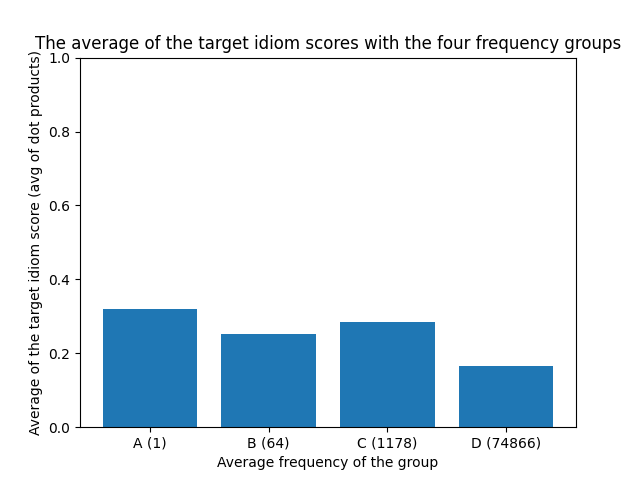
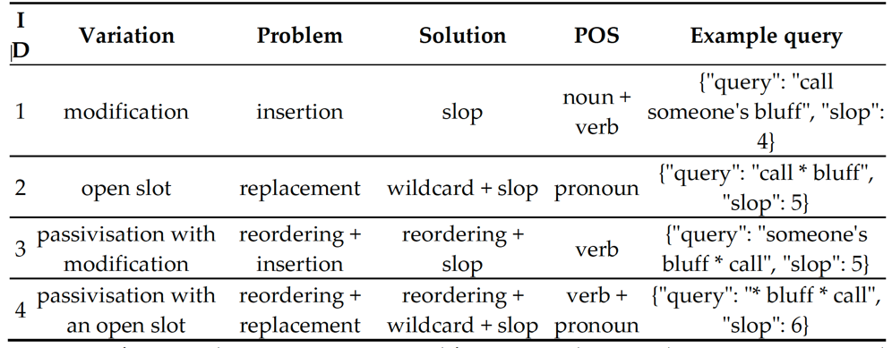

## idiomify

As for evaluating a search engine, ranking metrics such as DCG or NDCG, are used.
But we can't use them here, as labeling the ranks for 2710 idioms are constly task.

We instead focus on the dot product of phrase vector & a target idiom vector.
The more closer,

### The idioms to test for

the mean of the frequency is at 1178.

idiom | set | freq | def | synonyms
--- | --- | --- | --- | ---
let someone go | D | 142905 | to end someone’s employment | fire, discharege
to do with | D |60221 | to be connected with someone or something | conncted, associated, related
front and center | D | 21473 | in a prominent or important position. | prominantly, easily, clearly
scared to death | C | 1180 | Very severely frightened or worried | scared, frightened, worried
loud and clear | C |  1178 | very clear and easy to understand | clearly, precisely, accurately
have one's way | C | 1169 | To get or have what one wants | get, have, obtain
with bated breath | B | 64 | Eagerly or anxiously | excitedly, anxiously, hopefully
steady the ship | B |64 | By extension, to restore calm and order to a situatio | restore, repair, renovate
fire on all cylinders | B | 64 | to perform very well | perform, well, excel
bite off more than one can chew |  A |1 | to try to do something that is too difficult for you | try, attempt, diffcult
hit the buffers | A | 1 | to suddenly stop being successful or stop happening | stop, quit, suddenly
at the coal face | A |  1 | Actively doing a certain job | work, actively, job

> Note: this may not be reliable. Just use the definitions. They are much reliable than labeling things yourself.
> 




### Qualitative

1. 3 idioms that are frequently occuring.
2. 3 idioms that are kind of frequently occuring.
3. 3 idioms that have only a couple of occurences.
Hey, looks like we need.


### Quantitative
The cosine similarity. for the three.


### Comparison of 


## Idiom2Vec
### The results


### Evaluation

> How did we evaluate the model?
THe performance of different versions of Idiom2Vec on idiomify. Do it for the same set of labeled set.

Idiom2Vec version | corpora | stopwords removal | lemmatisation | Avg target scores
--- | --- | --- | --- | --- 
V1| COCA (spok) | not removed | lemmatised | 0.1712
V2 | COCA (spok), Opensubtitles | not removed | lemmatised  | 0.2553
V3 | COCA (spok), Opensubtitles | removed | lemmatised | 0.2225

- when stopwords are removed, the performance decreases.

> And also, qualitatively compare the most_similar function. What is going on?
- what could we learn from this? maybe a reassurence of the first point?
- how could we improve upon this?


> Another thing, lemmatisation may not be useful in this scenario.
- experiments are not done... but if we think about it.. the passive tense...?


## Now, idiom2collocations

> How do we evaluate the collocations?

idiom | tf |  tfidf  | pmi | representative example


> pmi, over different lower bound.
- very sensitive to frequencies. See that bound = 3 is adequate.
- why? explain why, by referring to the equation. pa


> How could we improve upon this? 
- different measures.
- machine learning approach.


## Lastly, identify-idioms

> How do we evaluate this? 
- cannot label all idioms in the corpus. Too costly. Instead, we write a testcase for the three
types of variations of idioms. I can't evaluate them, unless we label them. Since Labeling the dataset is costly,
we pseudo-evaluate the coverage by writing tests.
1. optional hyphens. at least three.
2. verb & noun inflections. at least three.
3. alternative forms. at least three.


> But limits - more variability should be covered, but they are not covered.
Other forms that the test cannot pass.

But there are limits!

```python
iip = build_iip()
sents = [
    # modification
    "grasp at straws",
    "Vologsky grasped desperately at the floating straw.",
    # open slot
    "Now you get frightened and keep me at arm's length!",
    "They preferred to persist in Piłsudski's strategy of keeping both Germans and Russians at arm's length.",
    # passivisation
    "The case could open the floodgates for thousands of similar claims worldwide.",
    "And with Wright gone, the floodgates were opened."
]

for sent in sents:
    tokens = iip(sent)
    # filter idioms
    idiom = [
        token.text
        for token in tokens
        if token._.is_idiom
    ]
    print(idiom)

```
```commandline
# modification
['grasp at straws']
[]
# open slot
["keep me at arm's length"]
["at arm's length"]
# passivisation
['open the floodgates']
[]
```
> Code.


> out


- *Leaving No Stone Unturned: Flexible Retrieval of Idiomatic Ex-2 pressions from a Large Text Corpus*


