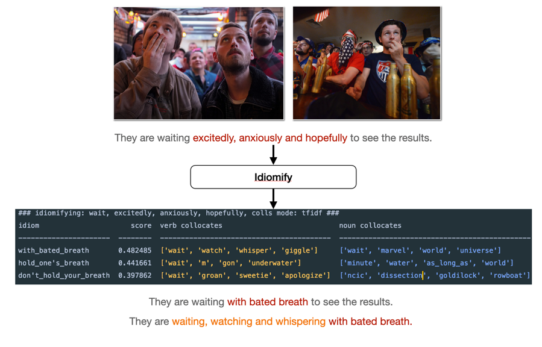

# Idiomify: Building a collocation-supplemented reverse-dictionary of idioms with Word2Vec for L2 learners
- author: Eu-Bin KIM
- the deadline is today. By 12pm. That is a hard deadline.
- expected word count: more or less 10000.
- write as much as you can. That's the goal
- keep it simple.


## Table of Contents
0. Abstract (500)
1. The Aim (450)
2. Motivations : why do we need Idiomify? (1500)
   - why build a reverse-dictionary of idioms? (700)
      - paragraph 1 (350) Because it helps L2 learners.
        - for L1: solves tip-of-the-tongue problem.
        - for L2: the tongue is not even on the tip.   
      - paragraph 2 (350) People have built reverse-dictionaries, but there are none for idioms.
   - why supplement the results with collocations of idioms? (700)
      - paragraph 1 (350) Because it helps L2 learners.
      - paragraph 2 (350) There are collocations for words, but there are none for idioms.
   - objectives. (200)
3. Methods & Justifications: How was Idiomify built? (4000)
   - Identifying idioms
     - what & why?
     - how?
     - how? - evaluate?  
   - Preprocessing data
     - what & why?
     - how?
   - Training Idiom2Vec
     - what & why?
     - how?
     - how? - evaluate?   
   - Suggesting idioms with Idiom2Vec
   - Modeling & Extracting Collocations of idioms
4. Results & Analysis: How could we improve Idiomify? (4000)
   - collocations of idioms
     - the results. (600)
     - the   
     - limitations? (600)
     - how could we overcome? (600)  
   - idiom2vec
     - results & good side. (600)
     - limitations?
     - how could we overcome?  
   - idiomify 
     - results & good side. (600)
     - limitations? (600)
     - how could we overcome? (600)
   
5. Conclusion (300)
6. References (300)


## Abstract

> What is your conclusion? Keep it simple!
  

## 1. The aim (450)

> {width=400px}


> What is the aim of the project? (220)

**Idiomify aims to suggest a list of idioms that best describe a given set of words to second language learners (i.e. L2 learners), 
while supplementing the results with collocations of the idioms.**
**Figure 1** illustrates this with an example scenario. Say we write *They are waiting excitedly, anxiously and hopefully to see the results* to describe
  the people in the images above. Assuming we are L2 learners of English (e.g. a native Korean learning English), we may wonder how the sentence could be paraphrased with an
  English idiom, if there is any. We therefore give a set of three words as the input to Idiomify: *excitedly*, *anxiously* and *hopefully*.
  Given the input, Idiomify suggests *with bated breath*, *hold one's breath* and *don't hold your breath* as the idioms that 
  are likely to capture the meaning of the three words, of which *with bated breath* is found to be the most appropriate one.
  We thereby learn to rephrase the sentence to *They are waiting with bated breath to see the results*. We are also informed 
that *with bated breath* collocates with *watch* and *whisper*, from the list of the verb collocates of the idiom.
We indeed notice that the people in the pictures are watching something and possibly whispering amongst them. We therefore learn to revise
our first try into a more precise and communicative one: *They are waiting, watching and whispering with bated breath*. 

> What is the aim of this report? ( < 200)

**This report aims to expand on why L2 learners would need a reverse-dictionary as such, how Idiomify was built for it and how we could further improve Idiomify.**
- section 2 - the motivations. (why?) explains why Idiomify could be useful for Second Language Learners (e.g. a Korean trying to learn English)
  - why build a reverse-dictionary of idioms?
  - why supplement it with collocations of idioms?  
- section 3 - the methods. (how?)  explains how the 
  - how do we build a reverse-dictionary of idioms?
    - related work?
    - so how are we doing it?  
  - how do we extract collocations of idioms from corpora?  
    - related work?
    - so how are we doing it?
- section 4 - the results and discussions (improvements?)  
  - wha

We will come back to this later.

## 2. Motivations
keep it simple. Keep it simple.
### 2.1 Why build a reverse-dictionary of idioms?


> What is the advantage of using idioms to L2 learners?

Do revisit the example in **Figure 1**.


The benefits of using idioms are apparent, but

> Why build a reverse-dictionary?

> Why build a reverse-dictionary of idioms?

> why extract collocations?

> Why extract collocations of idioms?
- helps L2 learners use


### 2.2 Why supplement the results with collocations of idioms?


Do revisit the example in  **Figure 1**.

First reason, as is the case with reverse-dictionaries, 

### 2.3 Objectives (restated)

... Motivated with the reasons stated above....
Just list out all of the things that will be discussed in the following, methods section.


## 3. Methods and Justifications: How was Idiomify built?

- discuss related work where we need it.

### 3.1 Identifying Idioms

> What & why?

**It is imperative to build an automatic pipeline for identify idioms **
- what set of idioms are we targeting at?


> How? - the challenge. 

It is challenging to identify idioms because they extensively vary in forms.
 Idioms are classified into two types: those that are syntactically frozen, i.e. non-compositional, and those that 
are more flexible, i.e. decomposable (Fischer and Keil, 1996). While non-compositional idioms are
readily identifiable in general by searching their nearly fixed forms (e.g. *by hook or by crook*), the hyphenated ones of which are not, because
we often omit hyphens. For instance, both *down-to-earth* and *down to earth* occur frequently in corpora. Compared with non-compositional idioms,
it is considerably more difficult to identify decomposable idioms because their constituent verbs and personal pronouns inflect.
For example, *find one's feet* may morph into *found your feet*, *finding my feet*, etc.
 Different types aside, idioms often occur in alternative forms, e.g.  *heap insult on injury* is an alternative for *add insult to injury* (*Wiktionary*, 2021).
This, together with optional hyphens and inflecting forms, poses a challenge to identifying idioms.


>base form|matching rule
>---|---
>*down-to-earth*|`[[LEMMA:down];[OPTIONAL:-];[LEMMA:to];[OPTIONAL:-];[LEMMA:earth]]`
>*find one's feet*|`[[LEMMA:find];[POS:personal pronoun];[LEMMA:feet]]`
>*add insult to injury*|`[[[LEMMA:add];[LEMMA:insult];[LEMMA:to];[LEMMA:injury]],[[LEMMA:heap];[LEMMA:insult];[LEMMA:on];[LEMMA:injury]]]`
>**Table 1**: Examples of the matching rules derived from the base form of idioms.

In order to handle their variability as such, we automatically derive matching rules from linguistic features of each idiom. **Table 1** illustrates how the matching rules are derived;
  Constituent lemmas, hyphens and part-of-speech are detected from the base forms (e.g. *personal pronoun* is derived from *one's*),
   which are sequentially joined with logical conjunction, denoted as `;`. Alternatives are added to the rules with logical
  disjunction, denoted as `,`, if they are stated in dictionaries.


```python

```
> Code 2.

>idiomatic expression|tokenised
>---|---
>*You are **down to earth***.|`['you','are','down-to-earth','.']`
>*Have you **found your feet** on the new job?*|`['have','you',"find one's feet",'on','the','new','job','?']`
>*To ask our members to accept a pay cut **heaps insult on injury**.*|`['to','ask','our','members','to','accept','a','pay','cut','add insult to injury','.']`
>**Table 2**: Examples of the derived matching rules in use.


> How? - the solution

The derived matching rules are then used to automatically identify an idiom as an atomic token. **Table 2** exemplifies how the rules identify idioms; In 
  all cases, idioms are identified as an atomic token. If hyphens are omitted, they are corrected to their hyphenated forms (see *down to earth*).
  Inflectional and alternative variations are detected and normalised to their base forms i.e. lemmatised (see *find one's feet* and *add insult to injury*).
  Deriving the rules and identifying idioms are done automatically with a python library that is developed by the author (Kim, 2021).


### 3.2 Preprocessing Data

### 3.3 Training Idiom2Vec

### 3.4 Building a reverse-dictionary of idioms

> How have people dealt with building a reverse-dictionary?
- make it chronological..
- a graph-based approach: WordNet.
- a machine-learning based appraoch: LSTM + Word2Vec

> So am I doing the same way as they did?
- We don't have "IdiomNet". Hence, though appealing, graph-based approach is not feasible.
- The second approach: might be feasible
- but the definitions of idioms are not as abundant as those for words.

> Then how are you going to do about it?
- why not just build an inverted index?
- In order to experiment, to see if we could do this purely with distributional semantics.
-> conclusion later: should be used in conjunction with an inverted-index approach. (That's what I'll be doing
  in the summer, anyways.)


### 3.5 Modeling & Extracting Collocations of Idioms

## 4. Results & Discussions: How could we improve Idiomify?

### 4.1 Idiom2Vec 
> evaluation?
- how do I evaluate this...? We evaluate the model with idiomify.

> good side
- show the results for most_similar_idioms.

> bad side & what did you learn?
- show the results for most_similar_words of `in_the_zone`
- why is that?
  1.I've trained it on idiom2sent dataset only. Not on the entire dataset.
    - **how is this flawed, mathematically speaking?** This is the part you really have to
  2. also, a second reason - maybe I shouldn't have lemmatised them. (e.g. in_the_zone -> focused, immersed, )

> how could we improve this?
- Train word2vec on the entire corpus.
- Train with a un-lemmatised corpus.


### 4.2 The collocations of idioms

> evaluation?

> first, a preliminary experiment.
- better get rid of proper nouns - don't render any collocational insights.

> Good side
- e.g. fair-and square.

> Bad side
- find an example

> How could we improve upon this?
- try different measures ... e.g. pearson, t-test.
- But the problem is, what model fits the concept of collocation best?
- this is a niche for machine learning. (Cite that paper.)
  - a research has been done about this - *MACHINE LEARNING FOR COLLOCATION IDENTIFICATION (Yang, 20??)*.


### 4.3 Idiomify

> evaluation?

> good side

> bad side & what did you learn?

> how could you improve upon it?
1. combination of inverted index search + word2vec.
 - (though previously, you did this only with word2vec) Provided that you have a set of definitions of idioms (can be solved
   with )

2. or, for full-machine learning approach: Take a BERT-based approach to this.
 - will be able to go beyond bow assumption, and idiomify an actual phrase.
 - will need to carefully labeled definitions of idioms.
 - 

--- 

## 5. Conclusion


Basically a summary of all.

- the collocations: the methods proposed could be used to compile a "Learner's Dictionary of Collocations of English Idioms"

--- 

## 6. References
