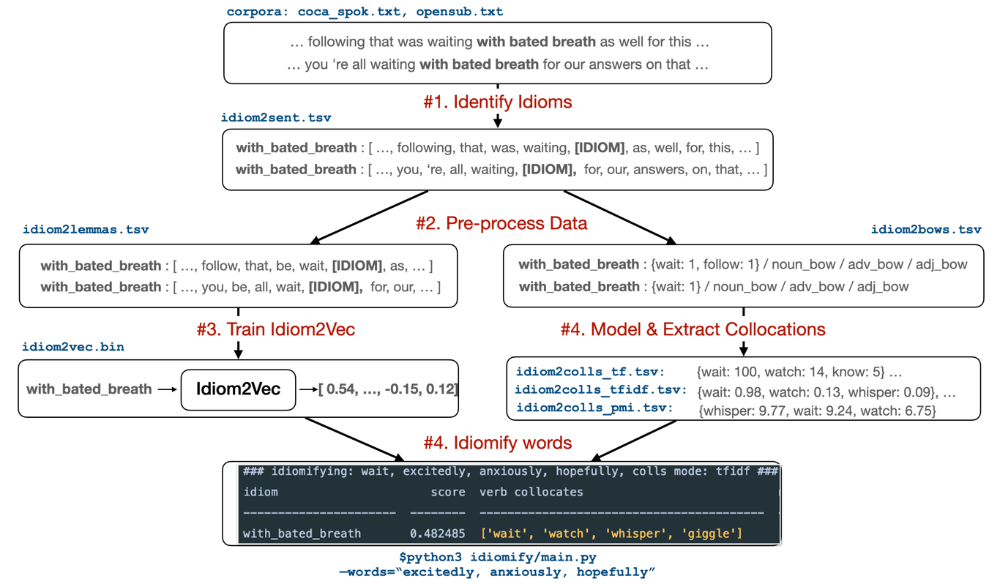
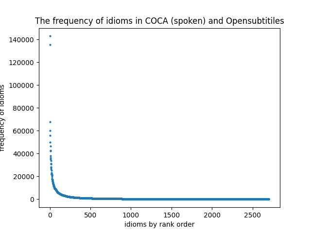
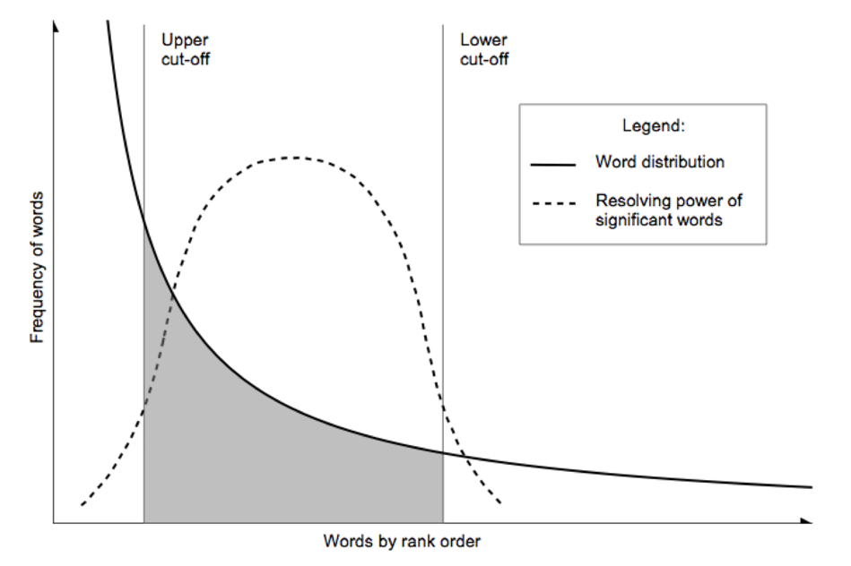

# Idiomify: Building a collocation-supplemented reverse-dictionary of idioms with Word2Vec for L2 learners of English
- author: Eu-Bin KIM
- the deadline is today, by 12pm okay? That is a hard deadline.
- what we need is fear. If you mess this up, you won't be able to go to Oxford, right? That much is certain.  
- expected word count: more or less 10000.
- from 3-6: Finish the aim & Motivations. 
- from 7-10: Finish the methods. (This is probably gonna take more than 3 hours... of course.)
- from 11pm - 2am: Finish the discussions.
- the marks goes to planning as well.   
- write as much as you can. That's the goal
- keep it simple.

--- 

## Abstract

> What is your conclusion? Keep it simple!


---

## Table of Contents
0. Abstract (500)
1. Introduction.
2. Motivations : why do we need Idiomify? (1500)
   2.1 why build a reverse-dictionary of idioms? (700)
   2.2 why supplement the results with collocations of idioms? (700)
      - paragraph 1 (350) Because it helps L2 learners.
      - paragraph 2 (350) There are collocations for words, but there are none for idioms. 
3. Related Work
   - Building a reverse dictionary of idioms.
   - Training an Idiom2Vec Model
   - Modeling and Extracting Collocations of idioms.
   - Identifying idioms.
4. Objectives.
   - The holistic picture of the subgoals should go in here.
5. Methods & Justifications: How was Idiomify built? (4000)
   1. Building a reverse dictionary of idioms.
     - what & why?
     - how?
     - how was this method evaluated? - qualitative
       - Just pick 5 idioms that are the most frequently appearing. (and therefore is likely to ...) 
     - How was this method evaluated? - quantitative
       - Randomly select 10 idioms. Give definitions. Use an evaluation metric used in 
         ranking. (I know I have learned this in ... ) - Use NDCG!
     - Which methods work best? comparison of sum / avg / w_avg. for the same method.
   2. Training an Idiom2Vec Model
     - what & why?
     - how?
       - trained until the loss platoes. (show the loss functio)
     - how was this method evaluated : qualitative evaluation.
     - how was this method evaluated : quantitative evaluation.
      - can't evaluate this as this is an unsupervised method. 
      - we compare version_1, version_2, version_3, version_4. over 30 idioms. 
        and compare the cosine similiarity with respect to ...  
   3. Modeling and Extracting Collocations of idioms.
     - what & why?
     - how?
     - how was this method evaluated?
       - comparing tfidf with pmi, and with the baseline tf.
       - Compare them with the representative examples found in an authoritative dictionary.
   - Pre-processing data.
     - what & why?
     - how?
   - Identifying idioms.
     - what & why?
     - how?  
6. Results & Discussions: How could we improve Idiomify? (4000)
   - collocations of idioms
     - the results. (600)
     - the   
     - limitations? (600)
     - how could we overcome? (600)  
   - Idiom2Vec
     - results & good side. (600)
     - limitations?
     - how could we overcome?  
   - Idiomify 
     - results & good side. (600)
     - limitations? (600)
     - how could we overcome? (600)
7. Conclusion (300)
   - Just a summary of everything here.
8. References (300)

--- 


### 3. Objectives

{width=500px}

**The main goal of project Idiomify comes down to five subgoals**. As discussed in **Section 1**, and as motivated 
in **Section 2**, the primary goal of the project is to build a collocation-supplemented reverse dictionary of idioms. 
**Figure 2** shows ... a holistic picture of... briefly explain them while mentioning the examples.
1. Identifying idioms: 
2. Pre-processing data: Prepare a dataset needed for step 3 and step 5.
3. Training Idiom2Vec: Train a word2vec on idiomatic sentences to obtain vector representations of idioms.
4. Reverse-searching idioms: 
5. Modeling & Extracting collocations of idioms


## 3. Methods and Justification: How was Idiomify built?

- notes on this:
  - Let's not care about related work here.
  - the related work will be discussed in the next sections.
- in the next iteration, let's fill in the related work


### 3.1 Identifying Idioms (`identify-idioms`)
#### 3.1.1 What and Why
>  What are you doing here, and why?

**It is imperative to automatically identify idioms from corpora if we were to prepare data to **
- what set of idioms are we targeting at?

#### 3.1.2 Related Work

> How have others done this? So, how do I link this to the next section?

It is challenging to identify idioms because they extensively vary in forms.
 Idioms are classified into two types: those that are syntactically frozen, i.e. non-compositional, and those that 
are more flexible, i.e. decomposable (Fischer and Keil, 1996). While non-compositional idioms are
readily identifiable in general by searching their nearly fixed forms (e.g. *by hook or by crook*), the hyphenated ones of which are not, because
we often omit hyphens. For instance, both *down-to-earth* and *down to earth* occur frequently in corpora. Compared with non-compositional idioms,
it is considerably more difficult to identify decomposable idioms because their constituent verbs and personal pronouns inflect.
For example, *find one's feet* may morph into *found your feet*, *finding my feet*, etc.
 Different types aside, idioms often occur in alternative forms, e.g.  *heap insult on injury* is an alternative for *add insult to injury* (*Wiktionary*, 2021).
This, together with optional hyphens and inflecting forms, poses a challenge to identifying idioms.

#### 3.1.3 Implementation

> So, how? (1) - deriving the rules

>base form|matching rule
>---|---
>*down-to-earth*|`[[LEMMA:down];[OPTIONAL:-];[LEMMA:to];[OPTIONAL:-];[LEMMA:earth]]`
>*find one's feet*|`[[LEMMA:find];[POS:personal pronoun];[LEMMA:feet]]`
>*add insult to injury*|`[[[LEMMA:add];[LEMMA:insult];[LEMMA:to];[LEMMA:injury]],[[LEMMA:heap];[LEMMA:insult];[LEMMA:on];[LEMMA:injury]]]`
>**Table 1**: Examples of the matching rules derived from the base form of idioms.

**In order to handle the variability of idioms, we automatically derive matching rules from linguistic features of each idiom with Spacy.**
**Table 1** illustrates how the matching rules are derived;
Constituent lemmas, hyphens and part-of-speech are detected from the base forms (e.g. *personal pronoun* is derived from *one's*),
which are sequentially joined with logical conjunction, denoted as `;`. Alternatives are added to the rules with logical
disjunction, denoted as `,`, if they are stated in dictionaries.
- what API in Spacy are we using? - Spacy's Matcher class. 

> So, how? (2) - using the rules.

```python
from identify_idioms.service import build_iip
sentences = [
    "You are down to earth.",
    "Have you found your feet on the new job?",
    "To ask our members to accept a pay cut heaps insult on injury."
]
# build a spacy pipeline for merging idioms, based off of en_core_web_sm model
iip = build_iip()

for sent in sentences:
    # process the sentence
    doc = iip(sent)
    # idioms are identified as atomic tokens in tokenisation process
    token_texts = [token.text for token in doc]
    # supports lemmatization of idioms as well
    token_lemmas = [token.lemma_ for token in doc]
    # is_idiom custom attribute can be used to filter idioms
    token_idioms = [token.lemma_ for token in doc if token._.is_idiom]

    print("tokenisation:", token_texts)
    print("lemmatisation:", token_lemmas)
    print("filtering:", token_idioms)
    print("-----------")
```
> Code 1:

```commandline
tokenisation: ['You', 'are', 'down to earth', '.']
lemmatisation: ['you', 'be', 'down-to-earth', '.']
filtering: ['down-to-earth']
-----------
tokenisation: ['Have', 'you', 'found your feet', 'on', 'the', 'new', 'job', '?']
lemmatisation: ['have', 'you', "find one's feet", 'on', 'the', 'new', 'job', '?']
filtering: ["find one's feet"]
-----------
tokenisation: ['To', 'ask', 'our', 'members', 'to', 'accept', 'a', 'pay', 'cut', 'heaps insult on injury', '.']
lemmatisation: ['to', 'ask', 'our', 'member', 'to', 'accept', 'a', 'pay', 'cut', 'add insult to injury', '.']
filtering: ['add insult to injury']
-----------
```
> Output 1:

The derived matching rules are then used to automatically identify idioms as atomic tokens. A python library specifically designed for this purpose
,named `identify-idioms`, was developed by the author (Kim, 2021).
**Code 1** and its **Output 1** exemplify how `identify-idioms` library can be used to automatically identify
*down-to-earth*, *find one's feet* and *add insult to injury* from the `sentences`. In all cases, idioms are identified as atomic tokens when
the `sentences` are tokenised (see the outputs for `tokenisation`). If hyphens are omitted, 
they are corrected to their hyphenated forms (see *down to earth*). Inflectional and alternative variations of idioms
are captured and normalised to their base forms i.e. they are lemmatised. (see *find one's feet* and *add insult to injury*).


(the resul)

> What file do you get with this? (We need to state this here, because we won't be showing the results here.)


- idiom2sent.tsv: with `build_idiom2sent.py`.  


### 3.2 Preprocessing Data


(data, idiom, examples.)
> table:
 
> What and why?
**prepare data needed for training an Idiom2Vec model with & extracting collocations of idioms from.**. 
- idiom2lemma2pos.tsv: `build_idiom2lemma2pos.py`
- idiom2bows.tsv: `build_idiom2bows.py`.


> What infrastructure are we using?
- 
Two corpora were used. 1. coca_spok and  2. Opensubtitles.


### 3.3 Training an Idiom2Vec Model
#### 3.3.1 What & Why

> Why do we need obtaining a numerical representation of idioms?
- as will be discussed ... hmm, wait, why do we need this? because Idiomify need this.
why does Idiomify needs this? Because Using Word2Vec is a good baseline for Concrete 


#### 3.3.2 Related Work

> Related work?
- there are many ways of vectorizing a token. the first way - a count-based approach.
  e.g. word-word co-occurence matrix-based methods. 
  - maybe cite the slides.
- but we choose Word2Vec.

- another way, a predictive approach. (I say predictive, because that's what the slide said.)
 - e.g. Word2Vec from the slide.
  - must mention the mathematics of it - the loss function.
 - e.g. Glove. show what this is capable of.


- W?
  - denser than count-based approach. More information. 
  - 


#### 3.3.3 Implementation


> the main script?

- code available on github: `idiom2vec`


### 3.4 Modeling & Extracting Collocations of Idioms 
#### 3.4.1 What and Why


#### 3.4.2 Related Work
> the main script ?

#### 3.4.3 Implementation
- code available on github: `idiom2collocations`

### 3.4 Idiomifying Words

#### 3.4.2. What and Why
- Implementing a Reverse Dictionary, based on word definitions, using a Node-Graph Architecture
- maybe cite OneLook.
- WantWords: An Open-source Online Reverse Dictionary System
- and also, machine learning approach.

#### 3.4.3 Related Work


#### 3.4.4 Implementation

> How are we evaluating things?

idiom | set | frequency | definition | synonyms
--- | --- | --- | --- | ---
let someone go | D | 142905 | to end someone’s  employment | fire, discharege
to do with | D |60221 | to be connected with someone or something | conncted, associated, related
front and center | D | 21473 | in a prominent or important position. | prominantly, easily, clearly
scared to death | C | 1180 | Very severely  frightened  or worried | scared, frightened, worried
loud and clear | C |  1178 | very  clear  and  easy  to  understand | clearly, precisely, accurately
have one's way | C | 1169 | To  get  or  have  what  one  wants | get, have, obtain
with bated breath | B | 64 | Eagerly or anxiously | excitedly, anxiously, hopefully
steady the ship | B |64 | By  extension,  to  restore  calm  and  order  to  a  situatio | restore, repair, renovate
fire on all cylinders | B | 64 | to perform very well | perform, well, excel
bite off more than one can chew |  A |1 | to  try  to do something that is too  difficult  for you | try, attempt, diffcult
hit the buffers | A | 1 | to  suddenly  stop  being  successful  or  stop  happening | stop, quit, suddenly
at the coal face | A |  1 | Actively  doing  a  certain  job | work, actively, job


- code available on github: `idiomify`

---

## 4. Results & Discussions: How could we improve Idiomify?

### 4.1 Identifying idioms

> Show us the results & evaluation metrics with descriptions?


> evaluation - how well does it work?


> Limits & further improvements?

- Do not forget to reference this very important paper: 
- The methods used does not scale well.
- It took over 3 days to identify idioms on coca_spok &  coca.

### 4.2 Training Idiom2Vec 

> Show us the results & evaluation metrics with descriptions?

- a comparison of...  version 1, version 2, version 3, version 4.. 
- for retrieval of synonyms of a specific idioms?


> Evaluation - how well does it work? 
- Maybe experiment with linear relationships here.


> Limits & further improvements?


### 4.3 Building a reverse dictionary of idioms
> What were the results?

> what could be the reason for that?

{width=350px}
- I drew this.

{width=350px}
- excepted from: *Understanding and customizing stopword lists for enhanced patent mapping*


- what do we learn from this? We get an unexpected results.
- more data -> better performance, no, this is not the case.
- link to stopwords & zip's law.
- the more frequent the idioms are, the more amorphous their meaning becomes. The more "stop idioms" they become.
- That's why we see such a trend.
- may need to disambiguate the sense.
- explanation & solution - luhn's cut-off points.


> What have you learned?
- It is not the case that stopwords must be removed. In some cases, leaving stopwords may help.

> Limits & further improvements?

### 4.3 Modeling & extracting collocations of idioms

> Show us the results with descriptions.
- (Some good examples for collocations. Provide 10). e.g. *fair and square*. 
- for 10 idioms (with more than ) including *fair and square*, just present collocations. Neatly in tables.

> How do we evaluate this? 
- We se

> What can we learn from the results?
- tfidf is as good of a model for collocations as pmi.
- pmi is very sensitive to frequencies.


> Limits & possible improvements

**It is difficult to choose

**We could also try different models of collocations**
- anything that models statistcal significance of things.
- here, cite the measures from that research (evaluating different methods)  
- t-test, pearson's measure. (ci)

**Rather than defining the model, we could take a machine learning approach instead.**
- We have to choose one model for collocation at the end.
- But if the actual model is a mixture of tfidf, pmi and t-score? 
  - if that is the case, then how do we determine which model contributes how much to the actual model?
- cite this paper - *machine learning for collocation identification* (Yang, 20??).


--- 

## 5. Conclusion


Basically a summary of all.

- the collocations: the methods proposed could be used to compile a "Learner's Dictionary of Collocations of English Idioms"

--- 

## 6. References
