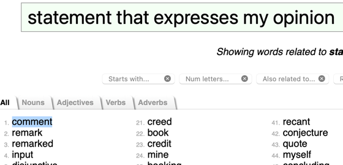

# Idiomify: Building a collocation-supplemented reverse-dictionary of idioms with Word2Vec for L2 learners of English

## Table of Contents
0. Abstract (500)
1. **Introduction** (400)
   1. the main aim
   2. the conclusion stated upfront
2. **Motivations : why do we need Idiomify?** (1400)
   1. why build a reverse-dictionary of idioms? (700)
   2. why supplement the results with collocations of idioms? (700)
3. **Related Work** (2400)
   1. Building a reverse dictionary of idioms (600)
      1. why are we doing this? - we've just discussed in the previous section. (100)
         but there are 
      2. how have others done it? (250)
      3. how would you do it and why?  (250)
   2. Vectorizing idioms (600)
      1. why are we doing this?
         - link back to the first. 
      2. how have others done it?
         - What is Word2Vec?
           - what, why and how? 
      3. how would you do it and why?
         - we will
   3. Modeling Collocations (600)
      1. why are we doing this? (100)
      2. how have others done it? (250)
         - Point-wise Mutual Information
      3. How would you do this? (250)
         - PMI but also experiment with tfidf.
         - model it with tf as the baseline.
   4. Identifying idioms (600)
      1. why are we doing this? (100)
      2. how have others done it? (250)
      3. how would you do this? (250)
4. **Objectives** (300)
   - the subgoals.
5. **Implementation and Results: How was Idiomify built?** (4000)
   1. Idiomifying words.
      1. implementation: How? - use Numpy.
         - just show a one-liner. the main script.
      2. results : Get a good baseline. 
   2. Training an Idiom2Vec Model. 
      1. implementation: How? - use gensim.
         - just show a one-liner. the main script.
      2. results.: Can find synonyms.
   3. Modeling and Extracting collocations of idioms.
      1. implementation: How? - use Numpy and Gensim.
         - just show a one-liner.
      2. results. Generally agree well with the representative use cases.
   4. Identifying idioms.
      1. implementation: How? - use spacy
         - show a one-liner.
      2. results. Just show a part of the...
6. **Limits and Analysis: How could we improve Idiomify?** (4000)
   1. Idiomifying words.
      - how did you evaluate it?
      - analyse the limits.
      - how could we improve upon the limits?
   2. Training an Idiom2Vec Model. 
      - how did you evaluate it?
      - analyse the limits.
      - how could we improve upon the limits?
   3. Modeling and Extracting Collocations of idioms.
      - how did you evaluate it?
      - analyse the limits.
      - how could we improve upon the limits?
   4. Identifying idioms.
      - how did you evaluate it?
      - analyse the limits.
      - how could we improve upon the limits?
7. **Conclusion (300)**
   - What have you achieved?
   - What have you learned?
    - discuss the things primairly from **Limits and Analysis**.
   - What is your final argument? 
    argument: With further improvements, the proposed methods could be used to aid L2 learners in
     acquiring English idioms.
8. References (300)

## 1. Introduction

> {width=450px}

> What is the aim of the project? (220)

**Project Idiomify aims to suggest a list of idioms that best describe a given phrase to second language learners, 
while supplementing the results with collocations of the idioms.**
**Figure 1** illustrates how we might use Idiomify with an example scenario. Say we write *They are waiting excitedly, anxiously and hopefully to see the results* to describe
  the people in the images above. If we were learning English as a second language (e.g. a native Korean learning English),
we may want to explore how the sentence could be paraphrased with an English idiom, if there is any (more on this reason will be discussed in the section **2.1**).
We therefore give the phrase as the input to Idiomify: *excitedly, anxiously and hopefully*.
  Given the input, Idiomify suggests *with bated breath*, *hold one's breath* and *don't hold your breath* as the idioms that 
  are most likely to capture the meaning of the phrase, of which *with bated breath* is found to be the most appropriate one.
  We thereby learn to rephrase the sentence to *They are waiting with bated breath to see the results*. 
As being second language learners, we may also wonder how we could use *with bated breath* more adequately than the first try (more on this reason will be discussed in 
the section **2.2**). Here, consulting "verb collocates" helps us in doing so. That is, we see that *with bated breath* collocates with *watch* and *whisper*, and we 
indeed notice that the people in the pictures are watching something while possibly whispering their wishful thinking. We therefore learn to revise
the first try into a more precise and communicative one: *They are waiting, watching and whispering with bated breath*. 

> What is the controlling idea of this report then? (200)

**This report expands on why L2 learners would need a reverse dictionary with collocations as such,
how Idiomify was built for this and how we could further improve Idiomify.**
-  **Motivations : why do we need Idiomify?** (1400)
-  **Related Work** (2400)
-  **Implementation and Results: How was Idiomify built?** (4000)
-  **Limits and Analysis: How could we improve Idiomify?** (4000)

- motivations
- Methods
  - building a reverse dictionary of idioms
  - modeling & extracting collocations  
- Results & Improvements
  - The reverse dictionary
    - demonstration
    - evaluation  
  - The collocations
    - demonstration
    - evaluation

---

\begin{table}[]
\begin{tabular}{l|l|llllll}
\hline
\multirow{2}{*}{idiom}                                & \multirow{2}{*}{frequency} & \multicolumn{5}{l}{collocations}                                                                                                                    & \multirow{2}{*}{use cases}                                                                                                                                                                                           \\ \cline{3-7}
                                                      &                            & model                      & verb                               & noun                      & adj                       & adv                       &                                                                                                                                                                                                                      \\ \hline
\multicolumn{1}{|l|}{\multirow{3}{*}{from\_a\_to\_z}} & \multirow{3}{*}{1}         & \multicolumn{1}{l|}{tf}    & \multicolumn{1}{l|}{(scan, 2)}     & \multicolumn{1}{l|}{None} & \multicolumn{1}{l|}{None} & \multicolumn{1}{l|}{None} & \multicolumn{1}{l|}{\multirow{3}{*}{\begin{tabular}[c]{@{}l@{}}He knew his subject from A to Z.\\ This book tells the story of her life from A to Z.\\ The book is titled "Home Repairs From A to Z."\end{tabular}}} \\ \cline{3-7}
\multicolumn{1}{|l|}{}                                &                            & \multicolumn{1}{l|}{tfidf} & \multicolumn{1}{l|}{(scan, 1.0)}   & \multicolumn{1}{l|}{None} & \multicolumn{1}{l|}{None} & \multicolumn{1}{l|}{None} & \multicolumn{1}{l|}{}                                                                                                                                                                                                \\ \cline{3-7}
\multicolumn{1}{|l|}{}                                &                            & \multicolumn{1}{l|}{pmi}   & \multicolumn{1}{l|}{(scan, 15.65)} & \multicolumn{1}{l|}{None} & \multicolumn{1}{l|}{None} & \multicolumn{1}{l|}{None} & \multicolumn{1}{l|}{}                                                                                                                                                                                                \\ \hline
\multicolumn{1}{|l|}{\multirow{3}{*}{}}               & \multirow{3}{*}{}          & \multicolumn{1}{l|}{}      & \multicolumn{1}{l|}{}              & \multicolumn{1}{l|}{}     & \multicolumn{1}{l|}{}     & \multicolumn{1}{l|}{}     & \multicolumn{1}{l|}{\multirow{3}{*}{}}                                                                                                                                                                               \\ \cline{3-7}
\multicolumn{1}{|l|}{}                                &                            & \multicolumn{1}{l|}{}      & \multicolumn{1}{l|}{}              & \multicolumn{1}{l|}{}     & \multicolumn{1}{l|}{}     & \multicolumn{1}{l|}{}     & \multicolumn{1}{l|}{}                                                                                                                                                                                                \\ \cline{3-7}
\multicolumn{1}{|l|}{}                                &                            & \multicolumn{1}{l|}{}      & \multicolumn{1}{l|}{}              & \multicolumn{1}{l|}{}     & \multicolumn{1}{l|}{}     & \multicolumn{1}{l|}{}     & \multicolumn{1}{l|}{}                                                                                                                                                                                                \\ \hline
\end{tabular}
\end{table}

## 2. Motivations

### 2.1 Why build a reverse dictionary of idioms?

(An example that illustrates a Tip-of-the-Tongue problem.)

> Why are we building a reverse dictionary? (250)   

alright.. I'll come back to this later.

**We build a reverse dictionary so as to help L2 learners explore new vocabularies on-demand.**
- reverse dictionaries are typically known to solve Tip-of-the-tongue states.
- that may be the case with L1 learners
- but this is not necessarily the case for L2 learners; they don't have enough exposure to vocabularies to enter TOT state,
  to begin with.
- That's why L2 learners tend to be wordy, lengthy. They lack vocabulary.

> Why are we building a reverse dictionary of idioms specifically? (250)

**Another problem that L2 learners face is that they tend to lack proficiency in idiomatic language**.
- RS: acquisition of idioms are crucial to proficiency in English for L2 learners, but they tend to lack idiomatic vocabulary.
- evidence?

> So, why are we building a reverse-dictionary of idioms? That part of idiomify? (250)

**We build a reverse dictionary of idioms so as to help L2 learners solve TOT problem and explore idioms.**
- RS:The two problems - L2 learners frequently enter TOT state, and they lack proficiency in idioms.
- RS.1: in the case where they have heard of an idiom before but just can't recall them,
  as they frequently do with any words (refer to the first paragraph),the reverse-dictionary part of idiomify can help them bring the memory back. 
  - e.g.1: Do revisit the concrete scenario in **Figure 1**. The learner may have heard of *with bated breath* before,
   but just can't retrieve it from memory. So the only thing he can do is giving a description as much as they can.
- RS.2. In the case where they have never heard. 
- e.g. In the context of **Figure 1** scenario, this implies that L2 learners may not even enter a TOT state because they
may not have been exposed to *with bated breath* in the first place. As far as idioms are concerned, L2 learners need to learn them
  
  
### 2.2 Why supplement the results with collocations of idioms?

>native|non-native
>---|---
>*bitterly cold*(40)|*bitterly cold*(7),*bitterly aware*(3),*bitterly miserable*(2)
>*blissfully happy*(19)|*blissfully happy*(4),*blissfully ignorant*(20)
>**Table 1**: Some responses of the native and non-native speakers to word-combining test (adapted from: Granger, 1998).

**Collocational knowledge is highly beneficial to L2 learners because they serve to guide them on using words naturally and precisely.**
   This is partly because L2 learners tend to lack native-like heuristics on collocation. Granger (1998) demonstrated this by having native and non-native speakers of English
    take "word-combing test", where they were asked to choose adjectives that acceptably collocate with a given amplifier (e.g. *bitterly*).
     As **Table 1** illustrates, L2 learners showed misguided sense of collocation (e.g. *blissfully ignorant*). This indicates that L2 learners 
     struggle to acquire collocational knowledge, which is why collocations dictionaries are effective supplements to them.
     The editors of *Oxford Collocations Dictionary for Students of English* (2002) well exemplify the benefits; 
    *strong rain* does get the idea across, but it would be more natural if it were revised to *heavy rain*. Likewise,
    *a fascinating book* is more precise than *a good book* because *fascinating* collocates with *book* and communicates more than *good*.  
 
**Whilst collocations of singular words are widely available, collocations of idioms are unavailable even though they do collocate.**
Idioms themselves are extremely strong collocations that have nearly fixed forms. Therefore, it is plausible to identify idioms as a "word" in a sentence, in which case
  collocation inevitably occurs. For example, *the government intends to seize power by hook or by crook* sounds more natural than
  *I'll assist you by hook or by crook*, and in both cases *by hook or by crook* effectively behaves as an atomic unit. Yet, no major dictionary
  publishers have yet attempted to compile collocations of idioms. 

**We supplement the output of Idiomify with collocations of idioms in order to assist L2 learners in using idioms adequately**.
The unavailability of collocations of idioms is discouraging to L2 learners because 
with the absence collocations of idioms, comes no guidance on natural and precise usage of idioms.
- contextualise this with **Figure 1**.  This. is. important. Yeah?

## 3. Related Work
### 3.1. Building a reverse dictionary of idioms

> why are we doing this?
> 
**As exemplified in **Introduction** section, and as motivated in **Motivation** section, the main aim of Idiomify is
to build a reverse dictionary of idioms.**

> how have others done it?
{width=400px}

**3 approaches have been done: inverted index, graphs,  distributional semantics**. 
- the inverted index approach.
  - e.g. OneLook
  - uses WordNet for similarity score  
- the graph-based approach.
  - e.g. that paper.
  - also leverages WordNet.  
- the distributional semantics approach.
  - e.g. that paper (Cho) - LSTM +

> how are you going to do it and why?

- (maybe show a diagram here!)

**Idiomify takes the distributional approach but solely leverages Word2Vec.**
- why? to push Word2Vec to its limits. How much can we get from distributional semantics, without inverted index, 
  graphs and LSTM's?
- why no graph-based approach? - we don't have "IdiomsNet", so this approach is not feasible.  
- why not inverted index? - this is a completely viable approach, but w
- why not use LSTM? why depend solely on Word2Vec? 
 - a great justification: *A simple but tough-to-beat baseline for sentence embeddings*.
- e.g. Revisit the situation in **Figure 1**. phrase_vector = takes an average of all the words, then apply svd.

### 3.2. Vectorizing idioms (600)
> why are we doing this?

> how have others done it?

> how are you going to do it and why?

### 3.3. Modeling Collocations (600)
> why are we doing this?

> how have others done it?
- pmi.

> how are you going to do it and why?
> 
      1. why are we doing this? (100)
      2. how have others done it? (250)
         - Point-wise Mutual Information
      3. How would you do this? (250)
         - PMI but also experiment with tfidf.
         - model it with tf as the baseline.
   4. Identifying idioms (600)
      1. why are we doing this? (100)
      2. how have others done it? (250)
      3. how would you do this? (250)

    
### 3.4. Identifying idioms

