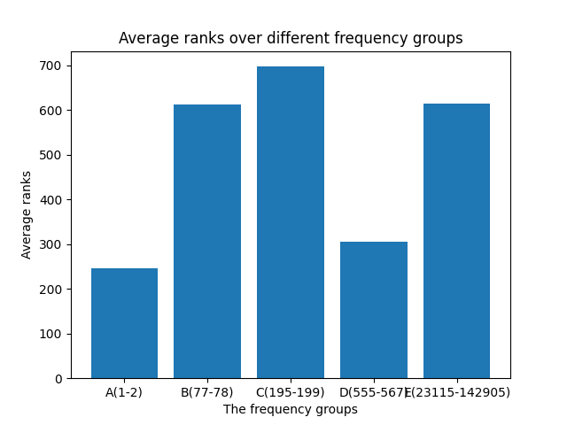

0. abstract
1. Introduction
  - what was the main aim?
  - broken down into two aims: idiomify & idiom2collocations  
  - the controlling idea.
2. Motivation
  - Why build a reverse dictionary of idioms?
  - Why supplement it with collocations of idioms?
3. Related Work and Methods
  - idiomify
    - why?
    - how have people done it?
    - how are we doing it?
  - idiom2collocations
    - why?
    - how have people done it?
    - how are we doing it?
  - identify-idioms
    - why?
    - how have people done it?
    - how are we doing it?
4. Objectives
   
4. Implementations and Results


care about that later. I've got to finish this first.
--- 

5. Evaluation and Improvement
  - idiomify
    - evaluation
       - a quantitative analysis (evaluation metrics indicating how well it performs.)
       - what's the good side of this?
       - what's the bad side of this?
    - improvement (how could we fix this?)
  - idiom2collocations
    - evaluation (quantitative or qualitative)
    - improvement (how could we improve upon what we currently have?)
  - identify-idioms
    - evaluation (the test I wrote for this)
      - good side
      - bad side
    -


## 5. Evaluation and Improvements
### Reverse-searching idioms
> how did you evaluate it?
- TABLE 1: a table of idiom/freq/def test set
**By averaging the ranks for the five groups.**
- make note of the ranking measures - we can't use them here.
- that should be the ground truth, but because it is constly to do so, we use a pseudo-eval metric here.  
- make sure to give an example of how we are doing this.

> what did you learn from the evaluations? 

>  

**The data indicates that...** 
- stop idioms: e.g. the thing is, some kind of, you know what.
- cite the graph...  
- this could be mitigated with more complicated models. (e.g. LSTM, or BERT).

> how could we improve upon this?: 1

**A mixture of distributed semantics approach & inverted index could **.
- we could continue improving the baseline using weighted average of vectors and truncating with
  SVD, as explained in "the formidable baseline" paper.
- or even try using BERT, to get out of bow assumption. (the two BERT paper, which leverages of transfer learing.)   
- but even if we do so, it seems apparent that distributional semantics approach alone is not a feasible solution.
- what we need is a combination of inverted index & distributional semantics approach.

> what did you learn from the evaluations? : 2

> Idiom2Vec version | corpora | stopwords removal | lemmatisation | Average ranks of the target idioms
> --- | --- | --- | --- | --- 
> V1| COCA (spok) | not removed | lemmatised | 543.686
> V2 | COCA (spok), Opensubtitles | not removed | lemmatised  | 494.9
> V3 | COCA (spok), Opensubtitles | removed | lemmatised | 553.28
> Table 3: Performance of idiomify by different versions of Idiom2Vec.

**We also see **.

### Modeling Collocations of Idioms

> How do I evaluate this? take.. three example sentences for each. 

#### Evaluations
#### Improvements

### Identifying idioms

> How did you evaluate it?

```python
class TestIdiomMatcher(TestCase):
    # ...
    # ...
    def test_optional_hyphens(self):
        # balls-out, balls out
        sent_balls = "in terms of rhyme, meter, and balls-out swagger."
        sent_balls_no_hyphens = "in terms of rhyme, meter, and balls out swagger."
        lemmas_catch = self.lemmatise(sent_balls)
        lemmas_catch_no_hyphens = self.lemmatise(sent_balls_no_hyphens)
        # blow-by-blow, blow by blow
        sent_blow = "he gave them a blow-by-blow account of your rescue"
        sent_blow_no_hyphens = "he gave them a blow by blow account of your rescue"
        lemmas_blow = self.lemmatise(sent_blow)
        lemmas_blow_no_hyphens = self.lemmatise(sent_blow_no_hyphens)
        self.assertIn("balls-out", lemmas_catch)
        self.assertIn("balls-out", lemmas_catch_no_hyphens)
        self.assertIn("blow-by-blow", lemmas_blow)
        self.assertIn("blow-by-blow", lemmas_blow_no_hyphens)

    def test_posn_verb_inflection(self):
        # teach someone a lesson.
        sent_teach = "they were teaching me a lesson for daring to complain."
        # ahead of one's time
        sent_ahead = "Jo is a playwright who has always been ahead of her time"
        lemmas_teach = self.lemmatise(sent_teach)
        lemmas_ahead = self.lemmatise(sent_ahead)
        self.assertIn("teach someone a lesson", lemmas_teach)
        self.assertIn("ahead of one's time", lemmas_ahead)

    def test_alternatives(self):
        # lemma - add fuel to the fire
        sent_add_fuel_1 = "others in the media have added fuel to the fire by blaming farmers"
        # alt 1 - add fuel to the flame
        sent_add_fuel_2 = "others in the media have added fuel to the flame by blaming farmers"
        # alt 2 - pour gasoline on the fire
        sent_add_fuel_3 = "others in the media have poured gasoline on the fire by blaming farmers"
        # alt 3 - throw gasoline on the fire
        sent_add_fuel_4 = "others in the media have threw gasoline on the fire by blaming farmers"
        # alt 4 - throw gas on the fire
        sent_add_fuel_5 = "others in the media have threw gas on the fire by blaming farmers"
        lemmas_1 = self.lemmatise(sent_add_fuel_1)
        lemmas_2 = self.lemmatise(sent_add_fuel_2)
        lemmas_3 = self.lemmatise(sent_add_fuel_3)
        lemmas_4 = self.lemmatise(sent_add_fuel_4)
        lemmas_5 = self.lemmatise(sent_add_fuel_5)
        self.assertIn("add fuel to the fire", lemmas_1)
        self.assertIn("add fuel to the fire", lemmas_2)
        self.assertIn("add fuel to the fire", lemmas_3)
        self.assertIn("add fuel to the fire", lemmas_4)
        self.assertIn("add fuel to the fire", lemmas_5)
```


- how good is this?
  
- how bad is this? - cite the idioms paper...

#### Improvements


