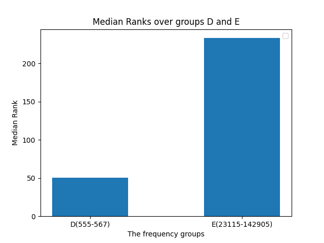

# Idiomify: Building a collocation-supplemented reverse-dictionary of English idioms for L2 learners of English
- author: Eu-Bin KIM
- supervisor: Professor Goran Nenadic
- 13th of May 2021

## Table of Contents

0. **abstract**
1. **Introduction**
  - what was the main aim?
  - broken down into two aims: idiomify & idiom2collocations  
  - the controlling idea.
2. **Motivation**
  - Why build a reverse dictionary of idioms?
  - Why supplement it with collocations of idioms?
3. **Related Work**
  - reverse-searching idioms
    - why?
      - well, for the reasons stated above, really.
    - related work. how have people done it?
    - the method. how are we doing it? (just a summary, more on this is discussed in the next section.)
  - modeling collocations 
    - why?
    - related work. how have people done it?
    - the method. how are we doing it? (just a summary, more on this is discussed in the next section.)
  - identifying idioms
    - why?
    - related work. how have people done it? ()
    - the methods. how are we doing it?
      - as for the vocabulary of idioms - SLIDE.
      - how would you go about handling the patterns?: get use of the linguistic feature of idioms.  
      - at the time I set out the development, 

5. **Implementations** - as for this, do this in a chronological order.
  - The subaims restated
     - with a big figure!
  - 5.1. identifying idioms
    - what infrastructure did I use?: SpaCy.
    - provide some examples: (the readme page of `identify-idioms`)
  - 5.2. preprocessing data
    - what infrastructure did I use?: `identify-idioms`, with multiprocessing.
    - provide some examples: all the tsv files.
  - 5.3.  modeling & extracting collocations of idioms.
    - what infrastructure did I use?: just pure python.
    - provide some examples: just a couple of results you've got. The big table will come up in the results section.
  - 5.4. training idiom2vec
    - what infrastructure did I use?: `gensim`.
    - provide some examples - an example of the synonym search of idioms.
  - 5.5. reverse-searching idioms
    - what infrastructure did  I use?: `identify-idioms`
    - provide some examples - going back to the first figure.  (e.g. `with bated breath`)
6. **Evaluations**
  - 6.1. Identifying idioms.
    - just present some examples.
    - evaluation (the test I wrote for this)
      - good side
      - bad side
  - 6.2. Modeling and extracting collocations
    - just present some examples
    - Evaluation (this has to be qualitative.). 
    - improvement (how could we improve upon what we currently have?)
  - 6.3. Reverse-searching idioms
    - Evaluation
       - a quantitative analysis (evaluation metrics indicating how well it performs.)
       - what's the good side of this?
       - what's the bad side of this?
    - improvement (how could we fix this?)
7. **Conclusion**
8. **References**

## 1. Introduction
State the main aim.

and also the sub-aims here. Do mention that they will be discussed in a different section.

but first, we will cover why want to achieve the main aim.

## 2. Motivation

---

## 3. Related Work

### 3.1. Reverse-searching Idioms

### 3.2. Modeling collocations of Idioms

### 3.3. Identifying Idioms

- Do mention the three cases.
- you may want to mention that you came up with the first three cases, but as for the remaining three, you referenced Hughess et. al (2021).
- the remaining three - were not taken into account, because the paper was published after I finished `identify-idioms`.

---

## 4. Implementations

Restate the subaims (that you mentioned in the introduction), with a big figure!

---

## 5. Evaluations

### 5.1. Identifying idioms

#### 5.1.1. Measures

We evaluate the flexibility of the idiom-matching patterns by testing them on six variation cases: optional hyphen, inflection, alternatives, modification, openslot and passivisation. 
We test if the patterns can identify an idiom from an exemplar sentence for each case. For instance, as for testing
for the alternatives case, we test if the patterns can identify *add fuel to the fire* from *others in the media **threw 
gasoline on the fire** by blaming farmers*, where *throw gasoline on the fire* is an alternative form to *add fuel to the fire*.
The results of the tests are presented in **Table C** and **Table D** below.

#### 5.1.2. Results & analysis

case | sentence | filtered idiom lemma
--- | --- | ---
optional hyphen(hyphenated) | *in terms of rhyme, meter, and **balls-out** swagger.* | `['balls-out']`
optional hyphen(hyphen omitted) | *in terms of rhyme, meter, and **balls out** swagger.* | `['balls-out']`
inflection(someone's) | *they were **teaching me a lesson** for daring to complain.* | `['teach someone a lesson']`
inflection(one's) | *Jo is a playwright who has always **been ahead of her time*** | `['ahead of one's time']`
alternatives(original) | *others in the media have **added fuel to the fire** by blaming farmers*  | `['add fuel to the fire']`
alternatives(1) | *others in the media have **added fuel to the flame** by blaming farmers* | `['add fuel to the fire']`
alternatives(2) | *others in the media have **poured gasoline on the fire** by blaming farmers* | `['add fuel to the fire']`
alternatives(3) | *others in the media have **threw gasoline on the fire** by blaming farmers* | `['add fuel to the fire']`
alternatives(4) | *others in the media have **threw gas on the fire** by blaming farmers* | `['add fuel to the fire']`

Table: The test results of the three positive cases: optional hyphen, inflection and alternatives.

The matching patterns are able to identify idioms with an optional hyphen, those with inflecting words and those in their alternative forms.
As can be seen from the first two rows of **Table C**, the patterns can correctly identify *balls-out*
regardless of whether the hyphen is omitted or not.
The patterns can also handle the case of inflections; 
they can identify *teach someone a lesson* from *teaching me a lesson* (personal pronoun inflection, the third row) and 
*ahead of one's time* from *ahead of her time* (possesive pronoun inflection, the fourth row). 
Lastly, we see that the patterns can identify *add fuel to the fire* from its four alternative forms: *add fuel to the flame*,
*pour gasoline on the fire*, *throw gasoline on the fire*, *throw gas on the fire*. 

case | sentence | filtered idiom lemma 
--- | --- | ---
modification | *He **grasped at straws*** -  *He **grasped desperately at the floating straw.*** |`['grasp at straws']`  -  `[]`
passivisation | *And with him gone, they **opened the floodgates.*** -   *And with him gone, **the floodgates were opened.*** | `['open the floodgamtes]` -  `[]`
open slot | *They preferred to persist in **keeping them at arm's length**.*  -  *They preferred to persist in **keeping both Germans and Russians at arm's length.***| `['keep someone at arm's length']` -  `['at arm's length']`

Table: The test results of the three negative cases: modification, open slot and passivisation.

Despite the three positive cases, the idiom-matching rules are unable to cover the case of modification, passivisation and open slot.
Although idioms could be modified with modals, be passivised, and their open slots, i.e. *one's* and *someone's*, could be replaced with a set of words (Hughes et al., 2021), the patterns do not take into 
account all the three cases. For instance, as can be seen in **Table D**, The patterns can no longer identify *grasp at straws* when it is modified to *grasped desperately at the floating straw* (the first row).
Likewise, they can no longer identify *open the floodgates* when it is written in a passive tense, as in *the floodgates were opened*(the second row). While they can identify *at arm's length* from *...keeping both Germans and Russians at arm's length*,
the identified idiom is nonetheless not the correct idiom at use (the third row); It should identify *keep someone at arm's length*, not just *at arm's lenth*.

#### 5.1.3. Improvement

variation | solution  | Example ElasticSearch query
--- | --- | --- 
modification | slop | `{“query”: “call someone’s bluff”, “slop”: 4}`
open slot | wildcard + slop |  `{“query”: “call * bluff”, “slop”: 5}`
passivisation with modification | reordering + slop  | `{“query”: “someone’s bluff * call”, “slop”: 5}`
passivisation with an open slot  | reordering + wildcard + slop | `{“query”: “* bluff * call”, “slop”: 6}`

Table: A summary of ElasticSearch query generation for retrieving idioms (Adapted from: Hughes et al., 2021)

We could improve the idiom-matching patterns if we incorporate slop, wildcard and reordering techniques into the patterns.
This could have them cover modification, open slot and passivisation cases. **Table E** illustrates how Hughes et al. (2021) achieve this, with *call someone's bluff*
as an example. Although they use ElasticSearch to implement their solutions, we could still adopt the techniques to
address the three negative examples introduced in **Table D** above. For instance, we could match *grasped desperately at the floating straw* 
with "grasp (slop) at (slop) straws" as "slop" would allow rooms for any words in between the constituent words of an idiom, thereby addressing the modification case.
We could also match *keeping both Germans and Russians at arm's length* with "keeping (slop) * (slop) at arm's length", as the wildcard
would allow for the open slot to be substituted with any word. We should also be able to match *the floodgates were opened* with 
"* the floodgates * open" as the position of the main verb is now reordered to address the passivisation.

### 5.2. Modeling Collocations of Idioms

#### 5.2.1. Measures

idiom | frequency/group | definition
--- | ---  | ---
bite off more than one can chew|1/A | To try to do too much
touch and go | 1/A | uncertain
installed base|2/A | The number of units of a system or product that are currently in use
spectator sport|77/B | Something, especially a process or activity, which is a popular object of observation
sweeten the pot|77/B | To make something more desirable
talk is cheap|78/B | used to mean that it is easy to say that one will do something
on one's bill|195/C | On the list of items one is expected to pay for.
muddy the waters | 197/C |to make something unclear and difficult to understand
offer one's condolences|199/C | To offer sympathy to someone who has recently experienced the loss of a loved one
have one's hands full|555/D | To be busy or thoroughly preoccupied.
lift a finger | 563/D	| To help with something.
in black and white|567/D | In writing
tell you what | 23115/E | used to introduce a suggestion
you know what |135422/E | used to get someone's attention
let someone go | 142905/E | fire, discharge someone

Table: used for testing both idiom2collocations & idiomify

> How did I evaluate this?

#### 5.2.2. Results & analysis

model | verb | noun | adj | adv
--- | --- | ---| ---| ---
tf |scan(2)  | -   | -   | - 
tfidf | scan(1.0)   | -   | -   | - 
pmi | -   | -   |  -   | -  

Table: Top 5 collocations and use cases for *from a to z(freq 1, group A)*.

oxford | cambridge | merriam webster 
--- | --- | ---
*He knew his subject from A to Z* | *This book tells the story of her life from A to Z.* | *The book is titled "Home Repairs From A to Z."*

Table: The representative use cases of *from a to z(freq 1, group A)*.

model | verb | noun | adj | adv
--- | --- | ---| ---| ---
tf |grow, know, fledge, die, mean | number, suit, form, courtesy, today  | great, **popular**, complete, big, large  | exactly, especially, fast, kind, long
tfidf | moneymake, fledge, grow, recommend, die   | tutoring, form, courtesy, suit, spectacle  | **popular**, anlocal, great, dry, mathematical   | exactly, generally, especially, fast, definitely
pmi | grow, know | suit, form, number   |  **popular**, great   | exactly

Table: Top 5 collocations and use cases for *spectator sport(freq 77, group B)*.

oxford | cambridge | merriam webster 
--- | --- | ---
*What is the country’s most **popular** spectator sport?* | *Football is certainly the biggest spectator sport in Britain.* | *For many, politics has become a spectator sport."*

Table: The representative use cases of *spectator sport(freq 77, group B)*.

model | verb | noun | adj | adv
--- | --- | ---| ---| ---
tf | grow, know, fledge, die, mean   | number, suit, form, courtesy, today   | great, **popular**, complete, big, large   | exactly, especially, fast, kind, long  
tfidf | moneymake, fledge, grow, recommend, die   | number, suit, form, courtesy, today   | **popular**, anlocal, great, dry, mathematical   | exactly, generally, especially, fast, definitely  
pmi | grow, know   | suit, form, number   |  **popular**, great   | exactly  

Table: Top 5 collocations and use cases for *best of both worlds(freq 195, group C)*.

oxford | cambridge | merriam webster 
--- | --- | ---
*What is the country’s most **popular** spectator sport?* | *Football is certainly the biggest spectator sport in Britain.* | *For many, politics has become a spectator sport.*

Table: The representative use cases of *best of both worlds(freq 195, group C)*.

model | verb | noun | adj | adv
--- | --- | ---| ---| ---
tf | gon, try, ve, think, know   | today, gon, guy, **mother**, police  | sure, **new**, private, separate, dear  | right, **certainly**, kind, kinda, clearly 
tfidf | gon, ve, try, deal, doubtless  | gon, **at the moment**, police, **nurse**, journalist  | sure, uterine, overloaded, **new**, liable  | kinda, **certainly**, right, kind, clearly  
pmi | investigate, ve, search, suspect, deal, gon | **at the moment**, gon,**nurse**, journalist, guard, bunch   | sure, **new**   | kinda, **certainly**, clearly, kind, obviously, right,

Table: Top 5 collocations and use cases for *have one's hands full (freq 555, group D)*.

oxford | cambridge | merriam webster 
--- | --- | ---
*She **certainly** has her hands **full with four kids** in the house* | *I'm sorry I can't help you -- I have my hands full **right now*** | *She'll have her hands full **with the new baby.***

Table: The representative use cases of *have one's hands full (freq 555, group D)*.

model | verb | noun | adj | adv
--- | --- | ---| ---| ---
tf | happen, **let**, want, gon, think  | time, people, man, problem, guy | wrong, good, great, right, little  | right, kind, maybe, actually, probably 
tfidf | happen, **let**, gon, want, think | problem, wrong, relief, pleasure  | wrong, great, good, right, able  |right, kind, actually, maybe
pmi | **-i'll**, privilege, irk, do--, to_do_with, transpire | barbecu, technicality-, stooling, musve, mcmahon'll   | DON'T, youtryto, uriel, cess, exploitable   | montero, mackowes, it'about, vega, weenie

Table: Top 5 collocations and use cases for *tell you what (freq 23115, group E)*.

oxford | cambridge | merriam webster 
--- | --- | ---
***I'll** tell you what— **let's** stay in instead.* | ***I'll** tell you what - we'll split the money between us.* | *(**I'll**) Tell you what—I'll **let** you borrow the car if you fill it up with gas.*

Table: The representative use cases of *tell you what (freq 23115, group E)*.

> How are the results? - some good parts, qualitatively. will come back to this.

> How are the results? - some bad parts, qualitatively. will come back to this.

- why bad? for the same reason *the*, *can* would have no significaiton collocations.
They are of little significance. They are "Stop Idioms", effectively.
- show the luhn's curve.  
- as for the group A, B, C and D - the corpus is not huge enough to believe in their trend.
- but as for group E: - this could be reliable. (in effect, those idioms have multi-sense entries in the dictionaries.)
- now... hmm...

#### 5.2.3. Improvement

> how could you improve upon what you currently have?
- one simple way - use a different model 

> how could you improve upon what you currently have?
- one simple way - use a different model.
- another way - you may not know what measures are the one. Maybe the right answer is a little bit of all of them.
 - this is a niche for machine learning. (cite that research.. right?)

### 5.3. Reverse-searching idioms

#### 5.3.1. Measures

- Put the table of the test set that you used to evaluate the whole thing.

> how did you evaluate it?
**Quantitative analysis: by computing median rank over the test set above.**
- why choose median rank? We could have used mmr (harmonic mean), ndcg, map, etc.
  - because we don't have labels other than the target idioms
  - but more because Cho et.al used this as the evaluation metric. need a research with which we can compare the performance of Iidomify.  

#### 5.3.2. Results & Analysis
> what did you learn from evaluation? - 1. we need a mixture of distributional semantics approach and inverted index approach.

model | method | median rank | variance 
--- | --- | --- | ---
Idiom2Vec (Idiomify) | avg | 128 | 4310
Word2Vec (Cho) | add | 923 | 163
Word2Vec (Cho) | mul | 1000 | 10
OneLook | - | 0 | 67
RNN cosine (Cho) | - | 12 | 103

Table: The test data for OneLook & RNN cosine is Cite it later.

**From the quantitative analysis, we see that averaging Idiom2Vec embeddings is a decent baseline.**
- as the table above indicates, we could do with RNN. Word2Vec as the labels, and cosine similarity as the loss function.
- we could continue improving the baseline using weighted average of vectors and truncating with
  SVD, as explained in "the formidable baseline" paper.
- or even try using BERT, to get out of bow assumption. (the two BERT paper, which leverages of transfer learing.)   
- but even if we do so, it seems apparent that distributional semantics approach alone is not a feasible solution.
- what we need is a combination of inverted index & distributional semantics approach.

**We could further improve Idiomify with a mixture of inverted index and distributional semantics approach.**
- why? - for unseen data. inverted index performs poorly .
- cite the paper.

> What did you learn from evaluation? - 

**We see that more data does not guraantee increase in performance**. 
- evidence? Look at the data above. Idiomify performs significantly worse on Group E than on Group D.
- why? Don't know for certain, but this may be because Group E idioms are mostly ... "Stop Idioms" (Need more research on this)  
- evidence for the reason? e.g.
- example for the reason? e.g. you know what? get out of here! 
- wrap it up.

**So how? use lunn's curve to detect "stop idioms", don't apply distributional semantics score to them**  
- use that... lun's curve. 
- could we train ""

> what did you learn from the evaluations? : 2

Idiom2Vec version | corpora | stopwords removal | lemmatisation | MRR
--- | --- | --- | --- | --- 
V1| COCA (spok) | not removed | lemmatised | 276.5
V2 | COCA (spok), Opensubtitles | not removed | lemmatised  | 128.0
V3 | COCA (spok), Opensubtitles | removed | lemmatised | 156.0

Table: Performance of idiomify by different versions of Idiom2Vec.

**Lastly, we also see that stopwords should not be removed from the training set**.
- evidence?: 
- why?
- example? 
- explanation?
- wrap up.

### 5.3.3. Improvements

> How could you improve upon what you currently have?

## Conclusion

## References

- Hughess, et al.